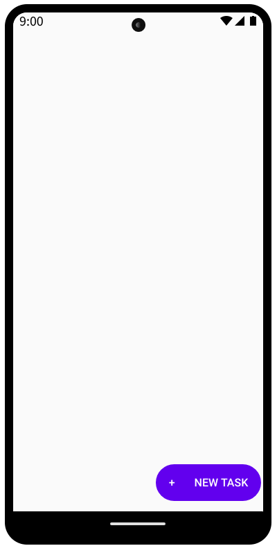
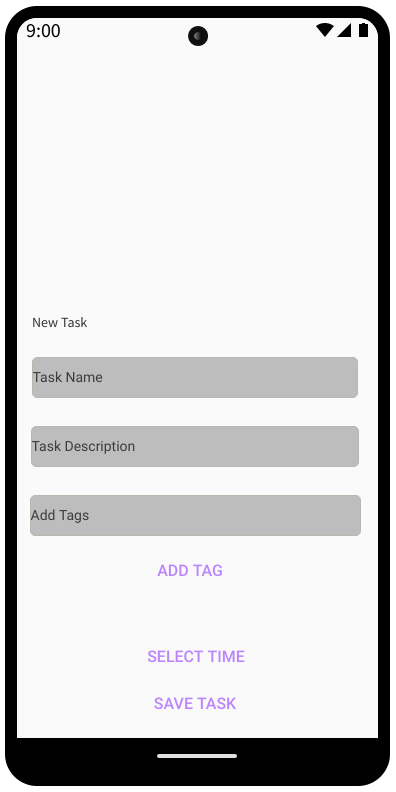
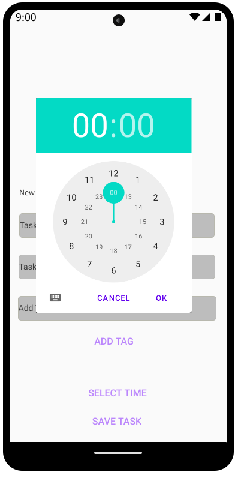
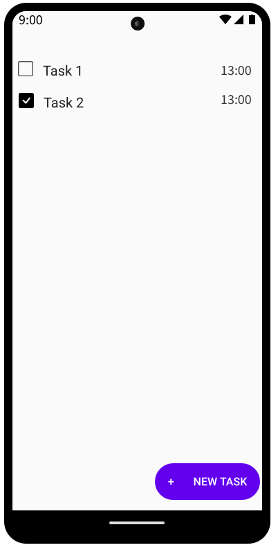
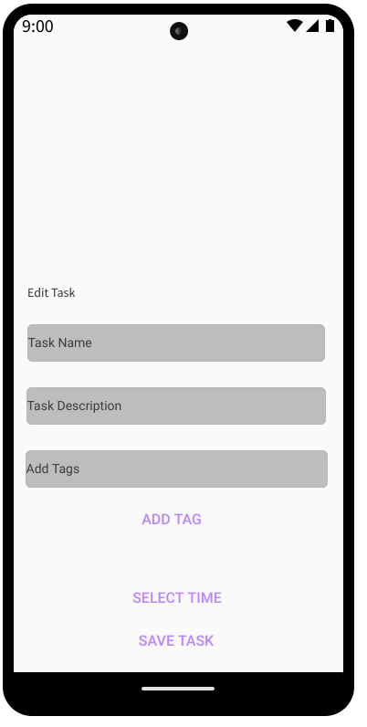

# Dokumentace To-Do List Aplikace

- Šimon Kochánek

## Úvod
Tato dokumentace popisuje základní funkce a testování To-Do List aplikace vyvinuté pro Android v rámci předmětu Návrh a vývoj mobilních aplikací. Aplikace umožňuje uživatelům spravovat jejich denní úkoly efektivně a přehledně.

## Funkce
Aplikace nabízí následující funkce:

- **Přidání úkolu:** Uživatelé mohou přidávat úkoly s názvem, popisem a časovým limitem.
- **Úprava úkolu:** Úkoly lze kdykoliv upravit, což zahrnuje změnu názvu, popisu, času a tagů.
- **Odstranění úkolu:** Uživatelé mohou jednoduše odstranit úkoly, které již nejsou aktuální nebo potřebné.
- **Označení úkolu jako dokončeného:** Úkoly lze označit jako dokončené s možností zobrazení datumu dokončení.

## Wireframes

### Hlavní scéna

### Nový task

### Nastavení času

### Pohleda na nově vytvořený task

### Kliknutím na něj spustím editaci Tasku

## Testování
Aplikace byla testována za účelem ověření její funkčnosti a uživatelské přívětivosti. Testování zahrnovalo:

- **Testování funkcionality:** Ověření, že všechny základní funkce aplikace pracují správně (přidání, úprava, odstranění úkolu).
- **Uživatelské testování:** Testování bylo prováděno skupinou uživatelů, aby se zjistilo, jak intuitivní a uživatelsky přívětivé je rozhraní aplikace.
- **Výkonnostní testování:** Testy byly prováděny za účelem zajištění, že aplikace běží hladce i s velkým množstvím úkolů.

### Použité zařízení
Aplikace byla testována na zařízení T-mobile T-Phone 2023, s verzí Androidu 14.0 což zajistilo, že aplikace funguje na nejnovější verzi Androidu.
